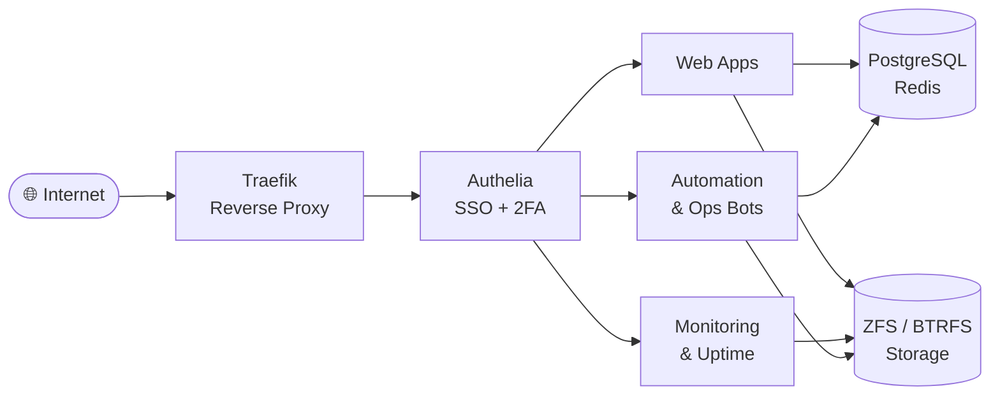

# 👋 Hi, I'm Gopinath Sekar — Data Engineer

Building robust **data pipelines**, automating everything I reasonably can, and running a fleet of **self-hosted services** to keep my ops skills sharp. I care about clean engineering, observability, and secure, scalable **cloud-native** systems.

🌱 **Currently exploring:** agentic AI workflows & AI-assisted engineering

<table>
<tr>
<td valign="top" width="55%">

#### 🛠️ Data Engineering & Cloud
- **Snowflake** — procedures, SDKs, perf tuning, Liquibase CI/CD
- **dbt** — data modeling & testing on Snowflake
- **AWS** — S3, Lambda, SNS, IAM, Secrets Manager, CloudFormation
- **Apache Airflow** — ETL orchestration, Dockerized DAGs
- **SQL · Python** — analytics, data-quality checks, automation
- **GitHub Actions · Docker** — CI/CD & reproducible environments

#### 📊 Analytics & Front-End
- **Tableau** — trusted-ticket auth, parameter automation
- **Angular · Node.js** — Tableau embedding, Express APIs, JWT
- **Grafana · Graylog** — metrics & centralized logging

#### 🏠 Self-Hosted Homelab
- ~40 containerized services · Docker + Traefik + Authelia SSO
- Custom **observability dashboard** (SvelteKit + FastAPI)
- ZFS / BTRFS · scripted auto-updates · ops bots

</td>
<td valign="top" width="45%">

  

  

</td>
</tr>
</table>

#### 📌 Featured Project
**[fda-recall-dashboard](https://github.com/azra3l05/fda-recall-dashboard)** — an end-to-end **FDA drug-recall data pipeline & dashboard**: Airflow DAGs ingest and clean public FDA data → PostgreSQL → Superset visualizations. Dockerized. `Python · Airflow · PostgreSQL · Superset`

🏗️ <b>Homelab architecture</b> (click to expand)

#### 🧰 Tools I Reach For

#### ⚡ A Few Things About Me
- 🏠 I self-host almost everything — if it can run in a container, it probably is.
- 📈 Obsessed with metrics — if it can be graphed, it's going to Grafana.
- 🐧 Daily-drive Linux (Ubuntu / Alpine); love tinkering with ZFS & BTRFS.
- 🔐 Big on secure pipelines — encryption, secrets management, and IAM done right.
- 🎮 Occasional detour into gaming & retro consoles.

#### 🤝 Connect

